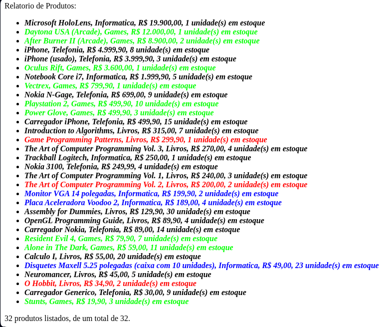

# Gerador de Relatórios

Exercício de Programação da disciplina de Computação Orientada a Objetos ministrada pelo docente Daniel Cordeiro na Universidade de São Paulo.
 
O objetivo é criar um gerador de relatórios em Java com opções de filtragem de critérios e formatação, dado uma tabela em .csv com produtos de diversas categorias. No final é gerado o arquivo 'saida.html' que permite visualizar o relatório. Para tal, o projeto usa dos princípios SOLID, padrão Decorator e Strategy. 

 
 

 
 

"Uso (após compilação de todos os arquivos Java):

        java GeradorDeRelatorios <\algoritmo\> <\critério de ordenação\> <\critério de filtragem\> <\parâmetro de filtragem\> <\opções de formatação\>
Onde:

        algoritmo: 'quick' ou 'insertion'

        criterio de ordenação: 'preco_c' ou 'descricao_c' ou 'estoque_c' ou preco_dc ou descricao_dc ou estoque_dc

        criterio de filtragem: 'todos' ou 'estoque_menor_igual' ou 'categoria_igual' ou 'substring' ou 'intervalo_de_preco'

        parâmetro de filtragem: argumentos adicionais necessários para a filtragem -`escreva o intervalo do menor para o maior no caso de intervalo_de_preco
        
        opções de formatação: 'negrito' e/ou 'italico' e/ou 'cor'"

 
 

